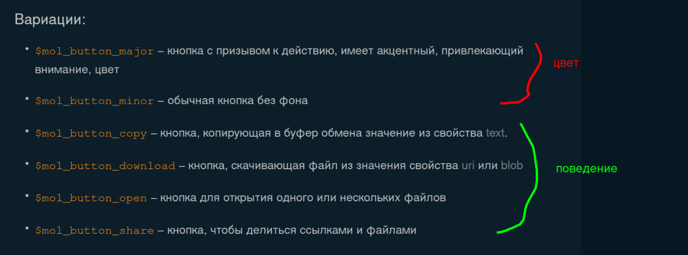

1) https://page.hyoo.ru/#!=1puhyu_hzns6

major, minor - это цвета, ниже поведение, из-за того, что они в ряд стоят, это неудобно. Нижние суффиксы соответствуют аспектам поведения, верхние цветам.
Сделать атрибутом major/minor. Мб в моём юзер флоу необходима кнопка major для копирования или открытия. 

Решение: 1 сущность согласно VALID
